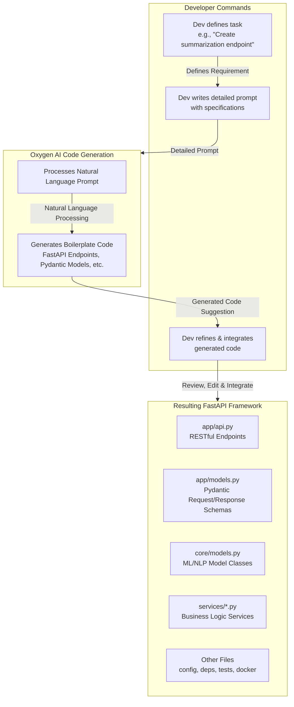
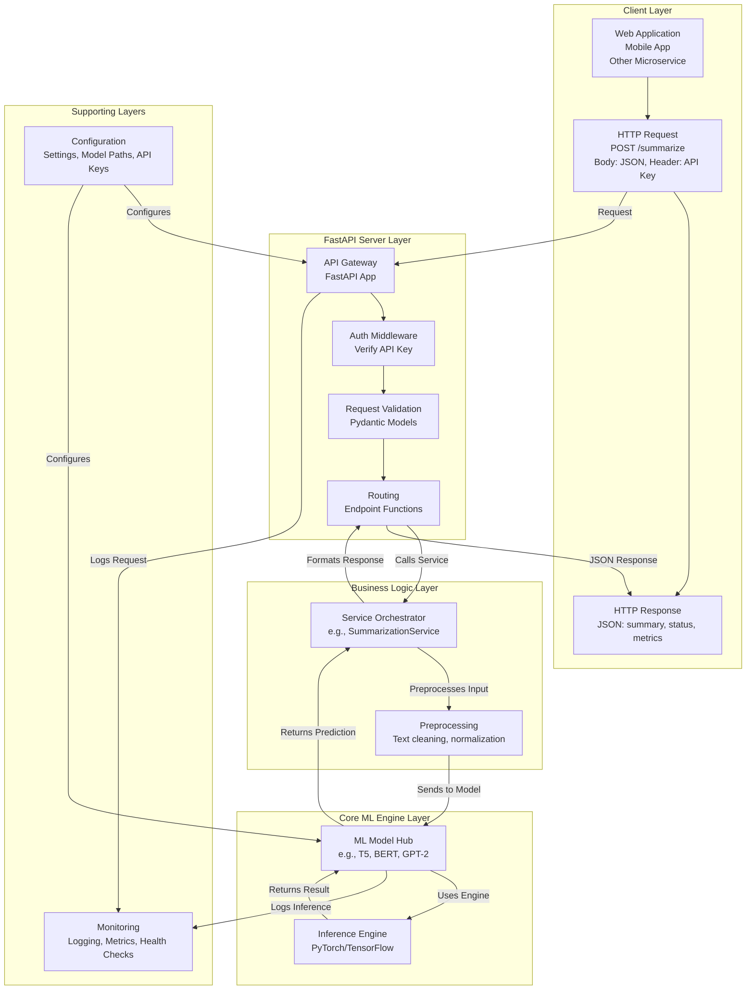

# Python-Script-for-ML-NLP-Development-Framework
Python Script for ML/NLP Development Framework
A comprehensive, production-ready framework for Machine Learning (ML) and Natural Language Processing (NLP) tasks. This modular system is specifically designed to support technical document authoring through classification, summarization, generation, and information extraction, all accessible via a robust FastAPI interface.

## 🚀 Features

- **🤖 Core ML/NLP Capabilities:**
  - **Text Classification:** Categorize technical documents (e.g., user manuals, API docs, tutorials).
  - **Text Summarization:** Generate concise summaries of long technical content.
  - **Text Generation:** Assist in content creation with AI-powered suggestions.
  - **Information Extraction:** Identify key entities, keywords, and relationships from text.
  - **Basic Image Processing:** Preprocess images for potential downstream ML tasks.

- **🔧 Engineering Excellence:**
  - **RESTful API:** Fully integrated with **FastAPI** for easy consumption by other services.
  - **Containerized:** Ready for deployment with **Docker**.
  - **Modular Design:** Clean separation of concerns for easy maintenance and extension.
  - **Asynchronous Ready:** Built for performance and scalability.
  - **Comprehensive Documentation:** Interactive API docs (Swagger UI & ReDoc) auto-generated.

- **⚙️ Production Ready:**
  - API Key Authentication.
  - Input Validation with Pydantic.
  - Centralized Configuration.
  - Structured Logging and Health Checks.
  - Custom Exception Handling.

## 🏗️ Architecture Overview

### Development Workflow with Oxygen AI

The framework is developed using Oxygen AI as a code-generation assistant in the development process:


## Runtime Integration Architecture
The framework follows a clean, layered architecture during runtime:



## 📁 Project Structure
```text
ml_nlp_framework/
│
├── app/ # FastAPI Application Layer (The Voice)
│ ├── api.py # Main API router and endpoint definitions
│ ├── models.py # Pydantic models for request/response schemas
│ └── dependencies.py # Security dependencies (API Key auth)
│
├── core/ # Core ML/NLP Logic (The Brain)
│ ├── models.py # Core model classes (TextClassifier, Summarizer, etc.)
│ ├── schemas.py # Internal data schemas
│ ├── config.py # Application settings and configuration
│ └── exceptions.py # Custom exceptions
│
├── services/ # Business Logic Layer
│ ├── classification_service.py
│ ├── summarization_service.py
│ ├── generation_service.py
│ ├── extraction_service.py
│ └── image_service.py
│
├── scripts/ # Utility Scripts for development
│ ├── train_model.py # Script for training new models
│ ├── preprocess_data.py # Data preprocessing and annotation
│ └── test_model.py # CLI for testing models
│
├── tests/ # Unit and Integration Tests
├── requirements.txt # Python dependencies
├── Dockerfile # Containerization setup
└── .env.example # Environment variables template
```


## 🛠️ Installation & Setup

### Prerequisites
- Python 3.9+
- pip
- virtualenv (recommended)

### 1. Clone and Setup Environment
```bash
git clone <your-repo-url>
cd ml_nlp_framework

# Create a virtual environment
python -m venv venv
source venv/bin/activate  # On Windows: .\venv\Scripts\activate

# Install dependencies
pip install -r requirements.txt
```

### 2. Download ML Models and Data
```bash
# Download spaCy English model
python -m spacy download en_core_web_sm

# Download NLTK data
python -c "import nltk; nltk.download('punkt'); nltk.download('stopwords')"
```

### 3. Configure Environment
```bash
# Copy the example environment file
cp .env.example .env

# Edit .env with your settings
# API_KEY=your-super-secret-key-here
# DEFAULT_MODEL=bert-base-uncased
```
## 🚀 Quick Start

### Running the API Server

```bash
# Start the FastAPI server with hot reload
uvicorn app.api:app --reload --host 0.0.0.0 --port 8000
```

Once running, access the interactive documentation:

Swagger UI: http://localhost:8000/docs

ReDoc: http://localhost:8000/redoc

### Using the API
Example using curl to summarize text:

```bash
curl -X 'POST' \
  'http://localhost:8000/summarize' \
  -H 'X-API-Key: your-super-secret-key-here' \
  -H 'Content-Type: application/json' \
  -d '{
  "text": "Machine learning is a subset of artificial intelligence that focuses on the development of computer programs that can access data and use it to learn for themselves. The process of learning begins with observations or data, such as examples, direct experience, or instruction, in order to look for patterns in data and make better decisions in the future based on the examples that we provide.",
  "max_length": 50,
  "min_length": 20
}'
```

## 📚 API Endpoints
| Endpoint    | Method | Description                  | Authentication |
|-------------|--------|------------------------------|----------------|
| `/health`   | GET    | System health check          | None           |
| `/classify` | POST   | Classify technical text      | API Key        |
| `/summarize`| POST   | Summarize long documents     | API Key        |
| `/generate` | POST   | Generate text from a prompt  | API Key        |
| `/extract`  | POST   | Extract entities and keywords| API Key        |

## 🐳 Docker Deployment
Build the Image
```bash
docker build -t ml-nlp-framework .
```
Run the Container
```bash
docker run -d -p 8000:8000 --name ml-api \
  -e API_KEY="your-production-key" \
  -e DEFAULT_MODEL="t5-small" \
  ml-nlp-framework
```
## 👥 Collaboration Guide
This framework is built for collaboration between ML engineers and technical writers.

### For ML Engineers
1. **Extend Core Models**: Add new models by extending classes in `core/models.py`.  
2. **Create New Services**: Add business logic in `services/`.  
3. **Add New Endpoints**: Expose new capabilities in `app/api.py`.  
4. **Optimize Models**: Use the `optimize_model` method or add training scripts in `scripts/`.  

### For Technical Writers
1. **Test API Endpoints**: Use the interactive Swagger UI at `/docs` to test features.  
2. **Provide Feedback**: Report challenges and requirements for new features.  
3. **Define Use Cases**: Collaborate on defining the input/output schemas in `app/models.py`.  

### Example Workflow
1. Technical writers identify a need for automatic tutorial generation.  
2. Teams collaborate to define the required **input** (outline, keywords) and **output** (formatted text).  
3. ML engineers implement a new `TutorialGenerator` service and expose it via a new `/generate_tutorial` endpoint.  
4. The endpoint is integrated into the company's content management system.  

## 🔧 Development
Running Tests
```bash
# Run the test suite
pytest tests/
```
### Adding a New Model/Service

 1. Add core model logic in core/models.py
 2. Create a service in services/
 3. Define request/response schemas in app/models.py
 4. Add an API endpoint in app/api.py
 5. Write tests in tests/

### Data Processing Pipeline
The framework supports a full ML workflow:

```python
# 1. Data Collection (Customize for your sources)
# 2. Preprocessing (scripts/preprocess_data.py)
# 3. Annotation (Collaborate with technical writers)
# 4. Model Training (scripts/train_model.py)
# 5. Evaluation & Integration (services/, app/api.py)
```
## 🚧 Future Enhancements
Model fine-tuning pipelines

Advanced monitoring (Prometheus/Grafana)

Async model inference for better performance

Rate limiting and advanced authentication

Support for more file formats (PDF, DOCX)

Model versioning and A/B testing endpoints

## 📊 Model Performance
Continuous improvement of model accuracy is a core goal:

Track metrics via the /health endpoint

Implement evaluation scripts to benchmark model performance

Use feedback loops from technical writers to identify areas for improvement

Stay current with latest Hugging Face and SOTA models

## 🤝 Contributing
Fork the repository

Create a feature branch (git checkout -b feature/amazing-feature)

Commit your changes (git commit -m 'Add some amazing feature')

Push to the branch (git push origin feature/amazing-feature)

Open a Pull Request

## 📄 License
This project is licensed under the MIT License - see the LICENSE file for details.

## 🆘 Support
For support, please open an issue in the GitHub repository or contact the development team.
