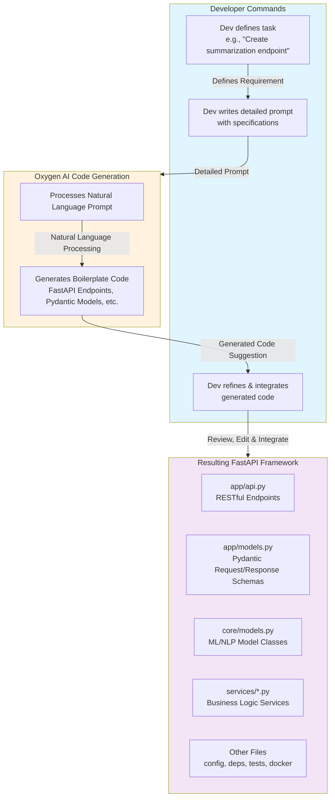
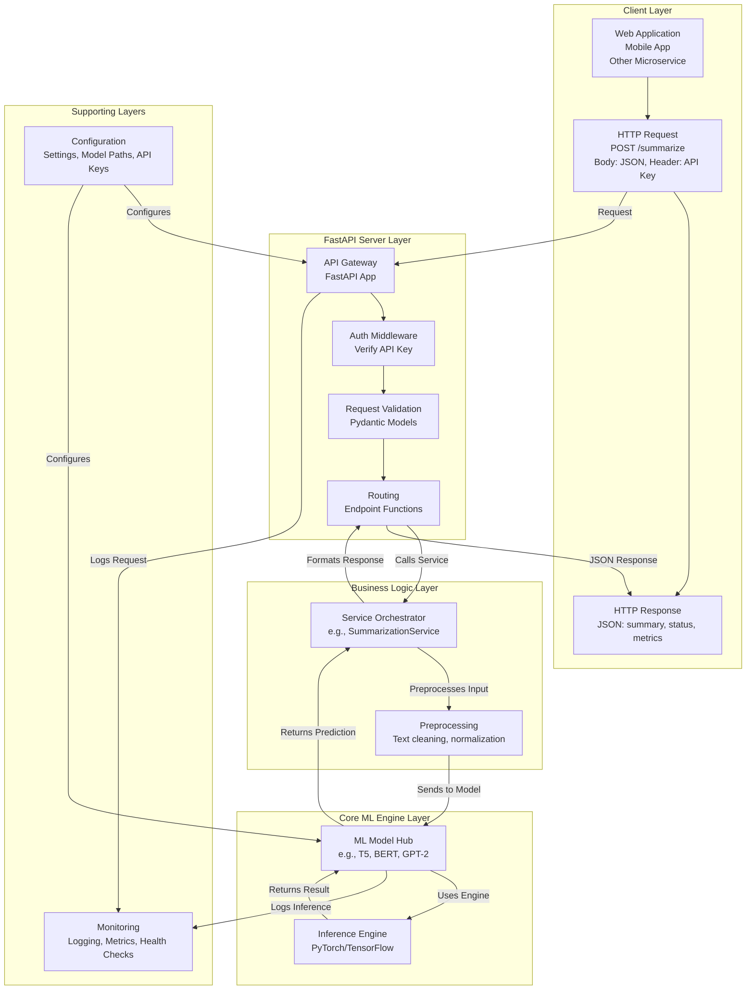

# Python-Script-for-ML-NLP-Development-Framework
Python Script for ML/NLP Development Framework
A comprehensive, production-ready framework for Machine Learning (ML) and Natural Language Processing (NLP) tasks. This modular system is specifically designed to support technical document authoring through classification, summarization, generation, and information extraction in Oxygen, all accessible via a robust FastAPI interface.

## The Big Picture: Why This Combination is Powerful
Think of the project in two main parts:

1. The ML/NLP Engine (The Brain): This is the modular Python script we started. It contains all the classes and functions for training, processing, and predicting. You develop this in Jupyter notebooks or Python scripts.

2. The API Layer (The Voice): This is what allows other applications (a web app, a mobile app, another service) to talk to your "Brain". They can't use the Python classes directly. They need to send a request (e.g., an HTTP POST request with some text) and get a response (e.g., a JSON object with the summary).

## 🚀 Features

- **🤖 Core ML/NLP Capabilities:**
  - **Text Classification:** Categorize technical documents (e.g., user manuals, API docs, tutorials).
  - **Text Summarization:** Generate concise summaries of long technical content.
  - **Text Generation:** Assist in content creation with AI-powered suggestions.
  - **Information Extraction:** Identify key entities, keywords, and relationships from text.
  - **Basic Image Processing:** Preprocess images for potential downstream ML tasks.

- **🔧 Engineering Excellence:**
  - **RESTful API:** Fully integrated with **FastAPI** for easy consumption by other services.
  - **Containerized:** Ready for deployment with **Docker**.
  - **Modular Design:** Clean separation of concerns for easy maintenance and extension.
  - **Asynchronous Ready:** Built for performance and scalability.
  - **Comprehensive Documentation:** Interactive API docs (Swagger UI & ReDoc) auto-generated.

- **⚙️ Production Ready:**
  - API Key Authentication.
  - Input Validation with Pydantic.
  - Centralized Configuration.
  - Structured Logging and Health Checks.
  - Custom Exception Handling.

## 🏗️ Architecture Overview

### Development Workflow with Oxygen AI

The framework is developed using Oxygen AI as a code-generation assistant in the development process:


## Runtime Integration Architecture
The framework follows a clean, layered architecture during runtime:


## Step-by-Step Plan to Implement with Oxygen and FastAPI
Here is a phased approach. You can use Oxygen to help accelerate almost every step, from generating boilerplate code to documentation.

### Phase 1: Project Foundation & Core ML/NLP Module (The Brain)
**Goal**: Solidify the core functionality without the API.

1. **Project Structure:**
Use Oxygen to generate a standard, maintainable project structure.

2. **Develop the Core Modules:**

- **Prompt for Oxygen**: "Generate a Python class `TextSummarizer` using the `transformers` library. It should have methods `load_model(model_name: str), summarize(text: str, max_length: int, min_length: int)` and handle errors."
- Do this for each task: `TextClassifier, TextGenerator, InformationExtractor.`
- **Key Improvement**: Make your `MLNLPFramework` class more modular. Instead of one big class, have separate smaller classes for each task. This is easier to test and maintain.
- Use Oxygen to generate docstrings, type hints, and unit tests for these classes.

3. **Data Preprocessing & Training Scripts:**

- Use Oxygen to generate robust data loading and preprocessing functions (e.g., handling different file formats: CSV, JSON, PDF text extraction).
- Create standalone scripts in `scripts/` for training. This separates the training code from the application code.

### Phase 2: API Layer with FastAPI (The Voice)
**Goal**: Expose the core modules as a web service that your development team can use.

4. **Set Up FastAPI Application:**

- `pip install fastapi uvicorn` (add to `requirements.txt`)
- **Prompt for Oxygen**: "Generate a basic FastAPI application in a file `app/api.py` with a root endpoint that returns `{"message": "Hello World"}`."
- Create Pydantic models in `app/models.py` to define the structure of requests and responses. This is crucial for automatic documentation and validation.
- **Prompt for Oxygen**: "Generate a Pydantic model `SummaryRequest` with a required field `text: str` and optional fields `max_length: int` and `min_length: int` with sensible defaults."

5. **Create API Endpoints:**

- Create an endpoint for each service. For example:

   - `POST /summarize` - Takes text, returns a summary.
   - `POST /classify` - Takes text, returns a classification.
   - `POST /generate` - Takes a prompt, returns generated text.

- **Prompt for Oxygen**: "Generate a FastAPI endpoint `/summarize` that uses the `SummaryRequest` model. The endpoint should import a `Summarizer` class from `core.models` and return the result."

6. **Integrate Core with API:**

- In your endpoint functions, you will:

   1. Receive the validated request data.
   2. Call the appropriate service (e.g., `summarization_service.summarize(text=request.text`)).
   3. Return the result.

- This is where your collaboration happens. The software team only needs to know the API endpoints, not the complex ML code underneath.

### Phase 3: Production Readiness

7. **Containerization (Docker):**

   - **Absolutely necessary for integration**. Use Oxygen to generate a `Dockerfile`.
   - **Prompt**: "Generate a Dockerfile for a FastAPI application. It should use a Python slim image, copy the `requirements.txt` file, install dependencies, and run the app with Uvicorn."
   - This allows your team to build and run your ML service anywhere.

8. **Advanced FastAPI Features:**

   - **Add Authentication**: Use Oxygen to generate code for API key authentication using FastAPI dependencies.
   - **Add Logging**: Generate a logging configuration to track requests and errors.
   - **Add CORS**: Essential if your web app is on a different domain.
   - **Generate OpenAPI Documentation**: FastAPI does this automatically. Once you run your app, visit /docs and /redoc.

9. **Testing and Validation:**
    
   - Use Oxygen to generate unit tests for your API endpoints using `pytest` and `httpx`.
   - **Prompt**: "Generate a pytest test for a FastAPI `/summarize` endpoint. Mock the summarization service."

### For the specific bullet points, FastAPI is not just a good idea; it's the enabling technology.

   - **"Integrate AI solutions into existing or new applications"**: This is the definition of an API. FastAPI is the cleanest, fastest, and most modern way to do this in Python.

   - **"Collaborate with technical writers / software development team"**: FastAPI's automatic interactive documentation (/docs) is a game-changer for collaboration. Your non-ML colleagues can instantly see how to use your models, what parameters to send, and what to expect back. They don't need to understand Python.

   - **"Maintain robust and scalable solutions"**: FastAPI is built on ASGI (Asynchronous Server Gateway Interface), which makes it very efficient and scalable. It's designed for modern production environments.

   - **"Communicate technical findings, challenges, and progress"**: A live, working API endpoint is the most powerful demonstration of progress. Instead of showing a Jupyter notebook, you can give your PM a URL to test the text summarizer themselves.

### Final Workflow with Oxygen
1. **Design**: Plan your module or endpoint.

2. **Prompt**: Ask Oxygen to generate the boilerplate code (class structure, FastAPI endpoint, Pydantic model, test).

3. **Implement**: Fill in the core logic, connect the pieces, and debug.

4. **Iterate**: Refine your prompts and code until it works perfectly.

This combination of a modular core powered by Oxygen and a clean, modern API powered by FastAPI will create a professional, scalable, and collaborative ML platform that directly addresses all the requirements.

## 📁 Project Structure
```text
ml_nlp_framework/
│
├── app/ # FastAPI Application Layer (The Voice)
│ ├── api.py # Main API router and endpoint definitions
│ ├── models.py # Pydantic models for request/response schemas
│ └── dependencies.py # Security dependencies (API Key auth)
│
├── core/ # Core ML/NLP Logic (The Brain)
│ ├── models.py # Core model classes (TextClassifier, Summarizer, etc.)
│ ├── schemas.py # Internal data schemas
│ ├── config.py # Application settings and configuration
│ └── exceptions.py # Custom exceptions
│
├── services/ # Business Logic Layer
│ ├── classification_service.py
│ ├── summarization_service.py
│ ├── generation_service.py
│ ├── extraction_service.py
│ └── image_service.py
│
├── scripts/ # Utility Scripts for development
│ ├── train_model.py # Script for training new models
│ ├── preprocess_data.py # Data preprocessing and annotation
│ └── test_model.py # CLI for testing models
│
├── integrations/
│   ├── oxygen/
│   │   ├── plugin/                 # Java plugin for Oxygen
│   │   ├── scripts/                # Transformation scripts
│   │   └── config/                 # Configuration templates
│   └── other_tools/                # Other potential integrations
│
├── scripts/
│   ├── xml_processing.py           # XML-specific processing utilities
│   └── oxygen_integration.py       # Oxygen-specific helpers
│
└── docs/
│    └── oxygen_integration_guide.md # How to integrate with Oxygen
├── tests/ # Unit and Integration Tests
├── requirements.txt # Python dependencies
├── Dockerfile # Containerization setup
└── .env.example # Environment variables template
```


## 🛠️ Installation & Setup

### Prerequisites
- Python 3.9+
- pip
- virtualenv (recommended)

### 1. Clone and Setup Environment
```bash
git clone <your-repo-url>
cd ml_nlp_framework

# Create a virtual environment
python -m venv venv
source venv/bin/activate  # On Windows: .\venv\Scripts\activate

# This will create (or overwrite) the file requirements.txt with your package list

cat > requirements.txt <<EOF
torch>=1.9.0
transformers>=4.15.0
datasets>=1.18.0
pandas>=1.3.0
numpy>=1.21.0
nltk>=3.6.0
spacy>=3.2.0
scikit-learn>=1.0.0
Pillow>=8.4.0
opencv-python>=4.5.0
tensorflow>=2.6.0
EOF

# Install dependencies
pip install -r requirements.txt
```

### 2. Download ML Models and Data
```bash
# Download spaCy English model
python -m spacy download en_core_web_sm

# Download NLTK data
python -c "import nltk; nltk.download('punkt'); nltk.download('stopwords')"
```

### 3. Configure Environment
```bash
# Copy the example environment file
cp .env.example .env

# Edit .env with your settings
# API_KEY=your-super-secret-key-here
# DEFAULT_MODEL=bert-base-uncased
```
## 🚀 Quick Start

### Running the API Server

```bash
# Start the FastAPI server with hot reload
uvicorn app.api:app --reload --host 0.0.0.0 --port 8000
```

Once running, access the interactive documentation:

Swagger UI: http://localhost:8000/docs

ReDoc: http://localhost:8000/redoc

### Using the API
Example using curl to summarize text:

```bash
curl -X 'POST' \
  'http://localhost:8000/summarize' \
  -H 'X-API-Key: your-super-secret-key-here' \
  -H 'Content-Type: application/json' \
  -d '{
  "text": "Machine learning is a subset of artificial intelligence that focuses on the development of computer programs that can access data and use it to learn for themselves. The process of learning begins with observations or data, such as examples, direct experience, or instruction, in order to look for patterns in data and make better decisions in the future based on the examples that we provide.",
  "max_length": 50,
  "min_length": 20
}'
```

## 📚 API Endpoints
| Endpoint    | Method | Description                  | Authentication |
|-------------|--------|------------------------------|----------------|
| `/health`   | GET    | System health check          | None           |
| `/classify` | POST   | Classify technical text      | API Key        |
| `/summarize`| POST   | Summarize long documents     | API Key        |
| `/generate` | POST   | Generate text from a prompt  | API Key        |
| `/extract`  | POST   | Extract entities and keywords| API Key        |

## 🐳 Docker Deployment
Build the Image
```bash
docker build -t ml-nlp-framework .
```
Run the Container
```bash
docker run -d -p 8000:8000 --name ml-api \
  -e API_KEY="your-production-key" \
  -e DEFAULT_MODEL="t5-small" \
  ml-nlp-framework
```
## 👥 Collaboration Guide
This framework is built for collaboration between ML engineers and technical writers.

### For ML Engineers
1. **Extend Core Models**: Add new models by extending classes in `core/models.py`.  
2. **Create New Services**: Add business logic in `services/`.  
3. **Add New Endpoints**: Expose new capabilities in `app/api.py`.  
4. **Optimize Models**: Use the `optimize_model` method or add training scripts in `scripts/`.  

### For Technical Writers
1. **Test API Endpoints**: Use the interactive Swagger UI at `/docs` to test features.  
2. **Provide Feedback**: Report challenges and requirements for new features.  
3. **Define Use Cases**: Collaborate on defining the input/output schemas in `app/models.py`.  

### Example Workflow
1. Technical writers identify a need for automatic tutorial generation.  
2. Teams collaborate to define the required **input** (outline, keywords) and **output** (formatted text).  
3. ML engineers implement a new `TutorialGenerator` service and expose it via a new `/generate_tutorial` endpoint.  
4. The endpoint is integrated into the company's content management system.  

## 🔧 Development
Running Tests
```bash
# Run the test suite
pytest tests/
```
### Adding a New Model/Service

 1. Add core model logic in core/models.py
 2. Create a service in services/
 3. Define request/response schemas in app/models.py
 4. Add an API endpoint in app/api.py
 5. Write tests in tests/

### Data Processing Pipeline
The framework supports a full ML workflow:

```python
# 1. Data Collection (Customize for your sources)
# 2. Preprocessing (scripts/preprocess_data.py)
# 3. Annotation (Collaborate with technical writers)
# 4. Model Training (scripts/train_model.py)
# 5. Evaluation & Integration (services/, app/api.py)
```
## 🚧 Future Enhancements
Model fine-tuning pipelines

Advanced monitoring (Prometheus/Grafana)

Async model inference for better performance

Rate limiting and advanced authentication

Support for more file formats (PDF, DOCX)

Model versioning and A/B testing endpoints

## 📊 Model Performance
Continuous improvement of model accuracy is a core goal:

Track metrics via the /health endpoint

Implement evaluation scripts to benchmark model performance

Use feedback loops from technical writers to identify areas for improvement

Stay current with latest Hugging Face and SOTA models

## 🤝 Contributing
Fork the repository

Create a feature branch (git checkout -b feature/amazing-feature)

Commit your changes (git commit -m 'Add some amazing feature')

Push to the branch (git push origin feature/amazing-feature)

Open a Pull Request

## 📄 License
This project is licensed under the MIT License - see the LICENSE file for details.

## 🆘 Support
For support, please open an issue in the GitHub repository or contact the development team.
